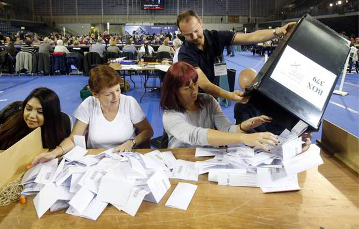

# Counting Election Votes To Determine Results Using Python

## Project Scope:
* Modernize small, rural town vote-counting process using Python. (Up until now, the city has been trustfully tallying them one-by-one...)

